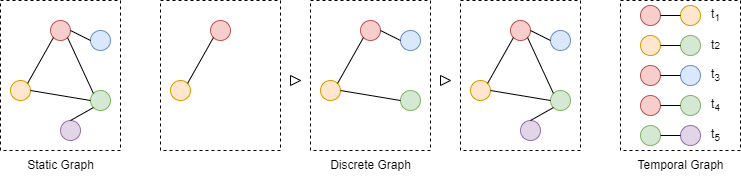

# ATGL: Awesome Temporal Graph Learning

ATGL is a collection of state-of-the-art (SOTA), novel temporal graph learning methods (papers, codes and datasets). If you find this repository useful to your research or work, it is really appreciated to star this repository. Any problems, please contact mengliuedu@163.com.

## What is temporal graph?

Temporal graph is a special kind of graph data in dynamic graphs. Graph data can be divided into static graphs and dynamic graphs depending on whether they contain time information.

Static graphs mean that a graph is fixed where neither topological structure nor node attribute changes over time. Unlike static graphs, dynamic graphs mean that a graph contains dynamic changes, which can be divided into **discrete** graphs (also call static snapshot graphs) and **temporal** graphs.

A discrete graph is a dynamic graph divided into a number of static snapshots at equal time intervals, and these static snapshots are ordered by time.

Since there are many interactions in the interval between two static snapshots, it is difficult to accurately represent graph changes, researchers began focusing on learning node embeddings in temporal graphs with chronological interactive events.

A temporal graph is similar to an interactive log. If nodes x and y interact at time t, we denote it as (x, y, t), and the temporal graph data is composed of these interactions, i.e., (x<sub>1</sub>, y<sub>1</sub>, t<sub>1</sub>), ..., (x<sub>n</sub>, y<sub>n</sub>, t<sub>n</sub>).

<div  align="center">    
    
</div>

## Survey

* Community discovery in dynamic networks: a survey (**ACM computing surveys**) [[paper](https://arxiv.org/pdf/1707.03186)]

## Paper

### 2024

* Deep Temporal Graph Clustering (**ICLR**) [[paper](https://arxiv.org/abs/2305.10738)][[code](https://github.com/MGitHubL/TGC)]

### 2023

* Dynamic Graph Evolution Learning for Recommendation (**SIGIR**) [[paper](https://dl.acm.org/doi/abs/10.1145/3539618.3591674)][[code](https://github.com/henrictang/DGEL)]

* Towards Better Dynamic Graph Learning: New Architecture and Unified Library (**NeurIPS**) [[paper](https://proceedings.neurips.cc/paper_files/paper/2023/file/d611019afba70d547bd595e8a4158f55-Paper-Conference.pdf)][[code](https://github.com/yule-BUAA/DyGLib)]

* TMac: Temporal Multi-Modal Graph Learning for Acoustic Event Classification (**ACM MM**) [[paper](https://arxiv.org/abs/2309.11845)][[code](https://github.com/MGitHubL/TMac)]

* Less Can Be More: Unsupervised Graph Pruning for Large-scale Dynamic Graphs (**arXiv**) [[paper](https://arxiv.org/pdf/2305.10673)][[code](https://github.com/EdisonLeeeee/STEP)][[note](https://blog.csdn.net/CSDNTianJi/article/details/132855957?spm=1001.2014.3001.5501)]

* Generating fine-grained surrogate temporal networks (**arXiv**) [[paper](https://arxiv.org/abs/2205.08820)]

* Graph Neural Networks for temporal graphs: State of the art, open challenges, and opportunities (**TMLR**) [[paper](https://openreview.net/pdf?id=pHCdMat0gI)]

  
### 2022

* Dynamic Graph Neural Networks for Sequential Recommendation (**TKDE**) [[paper](https://ieeexplore.ieee.org/abstract/document/9714053)][[code](https://github.com/CRIPAC-DIG/DGSR)]

* Neighborhood-aware Scalable Temporal Network Representation Learning (**LOG Best Paper**) [[paper](https://proceedings.mlr.press/v198/luo22a/luo22a.pdf)][[code](https://github.com/Graph-COM/Neighborhood-Aware-Temporal-Network)][note](https://blog.csdn.net/CSDNTianJi/article/details/133634640?spm=1001.2014.3001.5501)]

* TREND: TempoRal Event and Node Dynamics for Graph Representation Learning (**WWW**) [[paper](https://arxiv.org/pdf/2203.14303.pdf)][[code](https://github.com/WenZhihao666/TREND)][[note](https://blog.csdn.net/CSDNTianJi/article/details/126859612?spm=1001.2014.3001.5501)]

* Embedding Global and Local Influences for Dynamic Graphs (**CIKM Short**)

* An efficient procedure for mining egocentric temporal motifs (**DMKD**) [[paper](https://link.springer.com/article/10.1007/s10618-021-00803-2)]

* Pre-Training on Dynamic Graph Neural Networks (**Neurocomputing**) [[paper](https://arxiv.org/pdf/2102.12380.pdf)][[note](https://blog.csdn.net/CSDNTianJi/article/details/120711689)]

### 2021

* Continuous-Time Sequential Recommendation with Temporal Graph Collaborative Transformer (**CIKM**) [[paper](https://arxiv.org/pdf/2108.06625)][[code](https://github.com/DyGRec/TGSRec)][[note](https://blog.csdn.net/CSDNTianJi/article/details/132993073?spm=1001.2014.3001.5501)]

* Inductive Representation Learning in Temporal Networks via Causal Anonymous Walks (**ICLR**) [[paper](https://arxiv.org/pdf/2101.05974.pdf)][[code](https://github.com/snap-stanford/CAW)][[note](https://blog.csdn.net/CSDNTianJi/article/details/114488437)]

* Embedding Temporal Networks Inductively via Mining Neighborhood and Community Influences (**Applied Intelligence**)

* Inductive Representation Learning in Temporal Networks via Mining Neighborhood and Community Influences (**SIGIR Short**) [[paper](https://arxiv.org/abs/2110.00267)][[code](https://github.com/MGitHubL/MNCI)]
### 2020

* Temporal Graph Networks for Deep Learning on Dynamic Graphs (**ICML Workshop**) [[paper](https://arxiv.org/abs/2006.10637)][[code](https://github.com/twitter-research/tgn)][[note](https://blog.csdn.net/CSDNTianJi/article/details/127846239?spm=1001.2014.3001.5501)]

* Inductive representation learning on temporal graphs (**ICLR**) [[paper](https://arxiv.org/abs/2002.07962)][[code](https://github.com/StatsDLMathsRecomSys/Inductive-representation-learning-on-temporal-graphs)][[note](https://blog.csdn.net/CSDNTianJi/article/details/104325966)]

* DySAT: Deep Neural Representation Learning on Dynamic Graphs via Self-Attention Networks (**WSDM**) [[paper](http://yhwu.me/publications/dysat_wsdm20.pdf)][[code](https://github.com/aravindsankar28/DySAT)][[note](https://blog.csdn.net/CSDNTianJi/article/details/109530388)]

* Continuous-Time Dynamic Graph Learning via Neural Interaction Processes (**CIKM**) [[note](https://blog.csdn.net/CSDNTianJi/article/details/116721279)]

### 2019

* DyREP: Learing Representations over Dynamic Graphs (**ICLR**) [[paper](https://openreview.net/forum?id=HyePrhR5KX)][[note](https://blog.csdn.net/CSDNTianJi/article/details/103844015)]

* Self-attention with Functional Time Representation Learning (**NeurIPS**) [[paper](https://proceedings.neurips.cc/paper/2019/file/cf34645d98a7630e2bcca98b3e29c8f2-Paper.pdf)][[code](https://github.com/StatsDLMathsRecomSys/Self-attention-with-Functional-Time-Representation-Learning)][[note](https://blog.csdn.net/CSDNTianJi/article/details/105678080)]

* Predicting Dynamic Embedding Trajectory in Temporal Interaction Networks (**KDD**) [[paper](https://cs.stanford.edu/~srijan/pubs/jodie-kdd2019.pdf)][[code](https://github.com/srijankr/jodie)][[slide](https://cs.stanford.edu/~srijan/pubs/jodie-kdd2019-slides.pdf)][[note](https://blog.csdn.net/CSDNTianJi/article/details/105892100)]

* Node Embedding over Temporal Graphs (**IJCAI**) [[paper](https://www.ijcai.org/proceedings/2019/0640.pdf)][[code](https://github.com/urielsinger/tNodeEmbed)][[note](https://blog.csdn.net/CSDNTianJi/article/details/107761204)]

* Spatio-Temporal Attentive RNN for Node Classification in Temporal Attributed Graph (**IJCAI**) [[paper](https://www.ijcai.org/proceedings/2019/0548.pdf)][[code](https://github.com/DerronXu/STAR)][[note](https://blog.csdn.net/CSDNTianJi/article/details/108573691)]

### 2018

* Continuous-Time Dynamic Network Embeddings (**WWW**) [[paper](https://dl.acm.org/doi/pdf/10.1145/3184558.3191526)][[code](https://github.com/Shubhranshu-Shekhar/ctdne)][[note](https://blog.csdn.net/CSDNTianJi/article/details/100830263)]

* Embedding Temporal Network via Neighborhood Formation (**KDD**) [[paper](http://www.shichuan.org/hin/topic/Embedding/2018.KDD%202018%20Embedding%20Temporal%20Network%20via%20Neighborhood%20Formation.pdf)][[note](https://blog.csdn.net/CSDNTianJi/article/details/101921040)]


## Cite us

```bibtex
@inproceedings{TGC_ML_ICLR,
  title={Deep Temporal Graph Clustering},
  author={Liu, Meng and Liu, Yue and Liang, Ke and Tu, Wenxuan and Wang, Siwei and Zhou, Sihang and Liu, Xinwang},
  booktitle={The 12th International Conference on Learning Representations},
  year={2024}
}

@article{S2T_ML,
  title={Self-Supervised Temporal Graph Learning with Temporal and Structural Intensity Alignment},
  author={Liu, Meng and Liang, Ke and Zhao, Yawei and Tu, Wenxuan and Zhou, Sihang and Liu, Xinwang and He Kunlun},
  journal={IEEE Transactions on Neural Networks and Learning Systems},
  year={2024}
}
```
